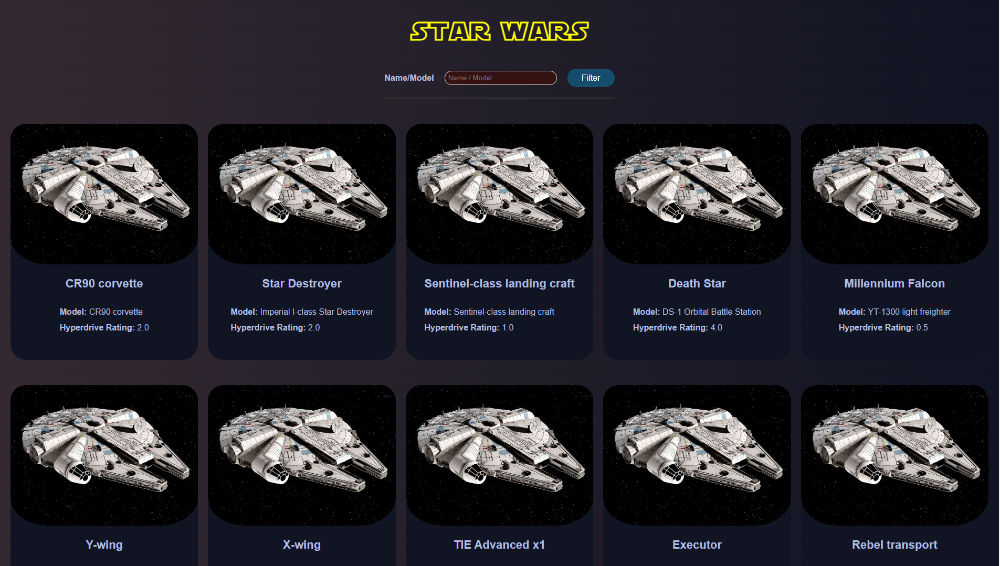
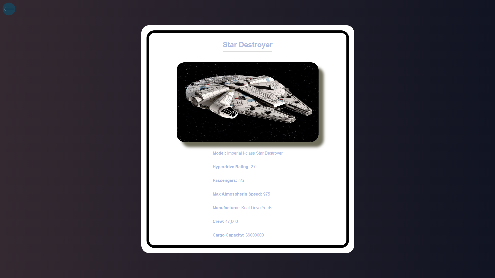

# Star Wars API Project

This is a React.js project that uses the Star Wars API to display a list of starships and their details.

## Technologies Used

- React.js
- Axios
- Router

## Preview

You can see a preview of the project by clicking on the following links:

### Home page preview

### Detail page preview

## Features

- List starships by using the Star Wars API
- Starship items should include name, model, and hyperdrive_rating
- Users can search starships by their name or model through the API, using a single input above
- Users can click on any item and go to a detail page that includes passengers, max_atmosphering_speed, manufacturer, crew, and cargo_capacity in addition to name and model
- Users can go back to the home page from the detail page
- Load more starships with a "Load More" button

## How to Run

To run this project locally, you'll need to follow these steps:

1. Clone the repository
2. Install dependencies by running `npm install`
3. Start the development server by running `npm start`

## Credits

This project was created by Yunus Emre GÜRLÜ as a part of FMSS Bilişim Front-end Practicum. It uses data from the [Star Wars API](https://swapi.dev/).
